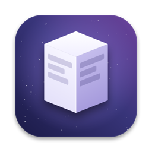
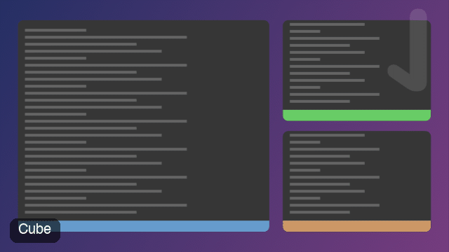
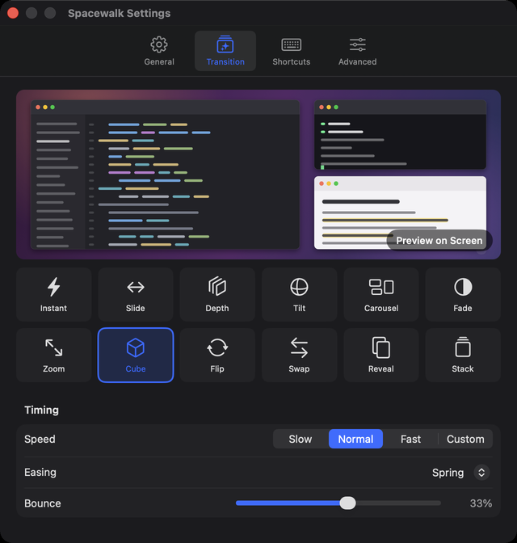
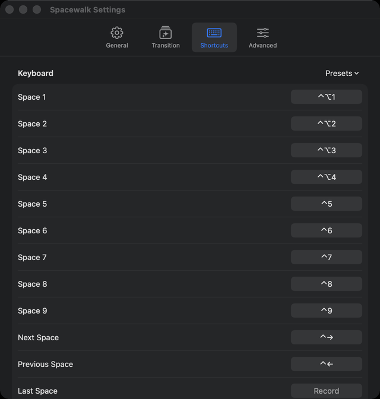
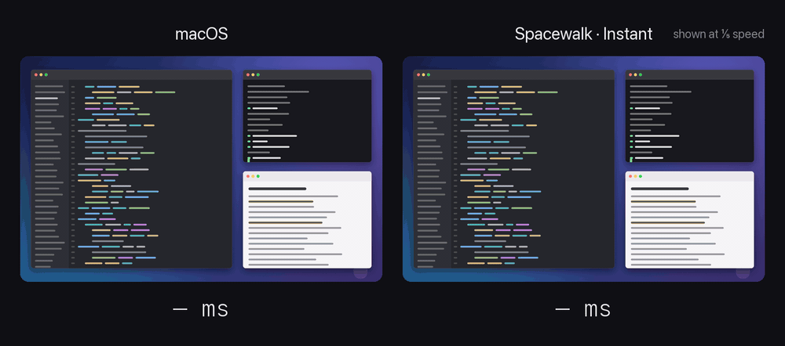

<p align="center">
  
</p>
<h1 align="center">Spacewalk</h1>
<h3 align="center">Instant, animated switching between macOS Spaces.</h3>

<p align="center">
  
  
  
  
</p>

<p align="center">
  
</p>

macOS moves between Spaces with one slow slide you cannot change. Spacewalk replaces it with a
transition you choose, or with none at all, on plain macOS Spaces. No window manager, no SIP
changes, no code injection.

It works by freezing the current picture in an overlay, asking the Dock to switch with nothing
left to animate, grabbing the new picture and playing the transition between the two. The menu
bar, the Dock and floating panels stay live above it. When the transition ends the overlay is
gone and the real windows are already there.

## Pick a transition

Twelve effects, each one tuned to hold a 100 Hz frame: **instant**, **slide**, **depth**,
**tilt**, **carousel**, **fade**, **zoom**, **cube**, **flip**, **swap**, **reveal** and
**stack**. The preview in Settings plays the one you select, with your speed and easing.

Speed is Slow, Normal, Fast or a duration in milliseconds. Easing is a curve or a spring with
bounce. The new Space can arrive from its side in the list or always from the same side, on a
horizontal or a vertical axis. Slide can let the wallpaper drift behind the windows, stay still
or travel with them. Every Space keeps its own wallpaper through the transition.

<p align="center">
  
  
</p>

## Or no animation at all

<p align="center">
  
</p>

Pick **Instant** and there is no transition: the Dock switches with nothing left to animate, and
the new Space is simply there. On a Space you have not visited through Spacewalk yet, its picture
is on screen 60 to 110 ms after the key; once Spacewalk has seen a Space, it keeps the last picture
and shows it in 12 to 13 ms, then fades the live frame in. macOS's own slide takes about half a
second and cannot be shortened. The counters above run at one fifth of real time; the numbers are
the ones measured in [`docs/AUDIT.md`](docs/AUDIT.md).

## Follow your fingers

Turn on the trackpad in Settings > Shortcuts and a three-finger swipe plays your transition
instead of the system slide. With **Follow my fingers**, the transition tracks the gesture in
real time, whatever the effect: lift past a third of the way or fling to switch, swipe back to
cancel. A haptic tick marks the point where lifting will switch; its strength is adjustable.

Side buttons 4 and 5 on a mouse, and scrolling against the top edge of the screen, can switch
Spaces too.

## See every Space

A hotkey, or the Mission Control swipe if you give it to Spacewalk, zooms the screen out into a
card among all your Spaces, each a real picture with its name and the icons of the apps on it.
Arrows, digits, typing a Space or app name, scrolling or a click pick one; the view zooms back
in and the switch happens underneath. Columns are configurable: one row, a vertical stack, or a
grid with row-up and row-down shortcuts.

Spaces can be named. Names show in the menu bar indicator, the Overview and the optional Spaces
bar, a thin strip at the top or bottom of the screen listing Spaces with their apps. A shortcut
can be bound to an app, so one key goes to whichever Space holds its window.

## Install

With Homebrew:

```sh
brew tap tornikegomareli/spacewalk https://github.com/tornikegomareli/Spacewalk
brew install --cask spacewalk
```

[Read the cask](Casks/spacewalk.rb) first if you would rather see what it does. It installs
the app and puts the `spacewalk` command on your PATH. The cask is also published to
[tornikegomareli/tap](https://github.com/tornikegomareli/homebrew-tap) with every release.

Or with one line, which downloads the latest notarized release, checks it with Gatekeeper,
copies it to /Applications and links the command into `~/.local/bin`:

```sh
curl -fsSL https://raw.githubusercontent.com/tornikegomareli/Spacewalk/main/install.sh | bash
```

Or grab [**Spacewalk.dmg**](https://github.com/tornikegomareli/Spacewalk/releases/latest/download/Spacewalk.dmg)
from the latest release.

Requirements:

- macOS 26.6 or newer on Apple Silicon. 26.0 to 26.5 have a WindowServer bug that blanks the
  screen on a zero-travel switch, so the app refuses to run there.
- Two permissions, asked for on first launch: Screen Recording, to see your Spaces, and
  Accessibility, to switch them.

On first launch Spacewalk asks how you want to switch: with **⌃1 to ⌃9**, by taking over
**⌃← and ⌃→** from the system, or with **three-finger swipes**. All three can be combined
later in Settings > Shortcuts.

Updates arrive through the app. It checks once a day, and every update is verified against an
EdDSA signature before it installs. Settings > General has the switch and a Check Now button.

## Remove

```sh
brew uninstall --cask spacewalk                                   # if installed with Homebrew
curl -fsSL https://raw.githubusercontent.com/tornikegomareli/Spacewalk/main/install.sh | bash -s -- --uninstall
```

Or quit Spacewalk and drag it to the Trash. Your settings in `~/.config/spacewalk` stay either
way; delete the folder for a clean slate. If you let Spacewalk take over ⌃← and ⌃→, turn that
off first in Settings > Shortcuts so the system shortcuts come back.

## Using it

- The menu bar item shows where you are, "2 ⁄ 3", and lists Spaces to click. It also opens
  Settings and the Overview, and can pause transitions.
- Shortcuts are recorded by clicking a field and pressing the keys. Spaces are numbered the way
  Mission Control shows them.
- If macOS is set to reorder Spaces by recent use, which is the default and makes numbered
  shortcuts drift, Settings > General says so and turns it off in one click.
- With "Displays have separate Spaces", an option switches every display to the same position.
- Two extras, off by default: a small pill naming the destination, and a short whoosh.

The `spacewalk` command drives everything from a terminal or a script:

```
spacewalk switch <n> | next | prev | back-and-forth
spacewalk overview               show every Space as a picture
spacewalk effect <name>          instant | slide | depth | tilt | carousel | fade | zoom | cube | flip | swap | reveal | stack
spacewalk duration <ms>          transition duration
spacewalk name <n> <text>        name the n-th Space
spacewalk bind arrows|digits|swipes   and unbind, for the three onboarding choices
spacewalk set <key> on|off       pill, sound, haptic, interactive, predictive, wrap, bar, …
spacewalk export|import <file>   all settings as TOML
spacewalk status                 state and recent timings as JSON
spacewalk preview                play the current effect on screen without switching
spacewalk settings               open the Settings window
```

`spacewalk --help` lists the rest.

## Settings

Everything lives in `~/.config/spacewalk/config.toml`. The app writes it with comments whenever a
setting changes and applies the file when you save it by hand. Keys use AeroSpace's spelling.

```toml
[transition]
effect = "cube"          # instant, slide, depth, tilt, carousel, fade, zoom, cube, flip, swap, reveal, stack
duration-ms = 240
easing = "smooth"        # smooth, snappy, easeOut, easeInOut, easeIn, linear, spring

[shortcuts]
space-1 = "ctrl-1"
next = "ctrl-right"
overview = "ctrl-alt-space"

[shortcuts.apps]
"com.apple.Safari" = "ctrl-alt-s"

[trackpad]
swipe = "follow"         # off, instant, follow
haptic = "strong"        # off, light, medium, strong, double

[spaces.names]
# Space uuid = name; easier to set in Settings > General
```

Settings > Advanced shows the path, reloads the file, and exports or imports a copy, handy for
sharing a preset. Any key it does not understand is reported there rather than ignored.

## How a switch works

1. A hotkey, swipe or command arrives. The latest frame from a persistent ScreenCaptureKit
   stream of app windows (about 1% CPU idle) goes into an overlay panel over a cached capture
   of the wallpaper.
2. Spacewalk posts a synthetic Dock swipe with near-zero progress and a strong fling. The Dock
   commits the switch through its own pipeline, so its state stays consistent, but there is
   nothing left to animate. Spacewalk waits for the Dock to report the new Space.
3. The first frame that arrives after the switch becomes the incoming picture and the animation
   starts. Fresher frames keep replacing it while the overlay is up.
4. Core Animation plays the effect in the render server. On completion the overlay hides.

A Space you have left through Spacewalk keeps its last picture, and the next switch back starts
moving from it before the Dock answers. Spaces never left through Spacewalk get a picture
composed in the background from captures of their windows. Each Space's wallpaper is captured
from the Dock's own wallpaper windows without visiting it.

Space bookkeeping comes from a few private SkyLight calls that AltTab, yabai and Hammerspoon have
relied on for years. The synthetic swipe uses undocumented CGEvent fields first mapped by
InstantSpaceSwitcher and noswoosh. If Apple changes the gesture format, switching stops until
Spacewalk is updated; nothing else on the system is touched. Measurements and the per-frame
budget are in [`docs/AUDIT.md`](docs/AUDIT.md).

## Development

```sh
git clone https://github.com/tornikegomareli/Spacewalk.git
cd Spacewalk
swift build
swift test
Scripts/install-from-source.sh    # build, sign, install to /Applications, link the CLI, launch
```

`Scripts/package_app.sh` signs with the certificate in `APP_IDENTITY` when it is in your keychain
and ad-hoc otherwise. A real certificate keeps the Screen Recording grant across rebuilds.

Two diagnostics need no permissions: `spacewalk render <dir>|scrub|36` writes 36 frames of the
current effect rendered offscreen, and `spacewalk snapshot <path>|settings` captures the settings
window alone. `Scripts/make_icon.sh` redraws the app icon from `Scripts/make_icon.swift`.

Releases are cut with `Scripts/release.sh <version>`: it builds, signs with Developer ID,
notarizes a DMG, signs the Sparkle update, regenerates `appcast.xml`, updates the cask and
publishes the GitHub release. `Scripts/setup-sparkle-keys.sh` manages the update-signing key.
Read [`CONTRIBUTING.md`](CONTRIBUTING.md) before opening a pull request.

## License

[MIT](LICENSE)
